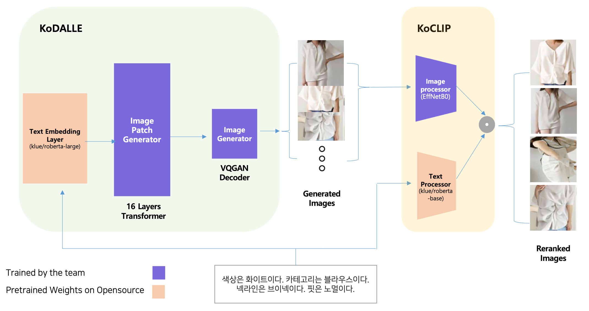
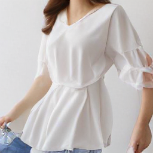
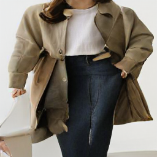
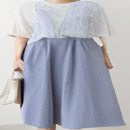
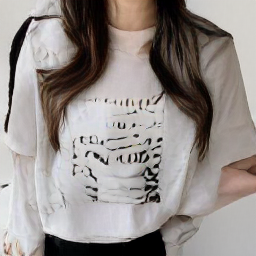

# KoDALLE

[](https://colab.research.google.com/drive/1sKNRH0fM73uLi-6BDgfGs3YiiVdvs6lU?usp=sharing) [](https://wandb.ai/happyface-boostcamp/final)



**Utilizing pretrained language model’s token embedding layer and position embedding layer as DALLE’s text encoder.**

### Background

- Training DALLE model from scratch demands large size paired dataset of images and captions. For example, OpenAI DALLE is trained with more than 250 million text-image pairs for the training.
- If the dataset isn’t large enough or is limited to specific domains, number of vocabularies in the trained DALLE model are insufficient. For instance, 1 million text captions of K-Fashion dataset only consists of more or less than 300 tokens.
- Therefore, inferencing from such DALLE models could be problematic if the given sentence query is unconnected to the originally trained captions’ text dataset.

### KoDALLE's Result on Small Size Fashion Dataset

|                        |      OpenAI’s DALLE       |           KoDALLE of HappyFace            |
| :--------------------: | :-----------------------: | :---------------------------------------: |
| **Train Dataset Size** |     250 Million Pairs     |             0.8 Million Pairs             |
|      **#Params**       |        12 Billion         |                428 Million                |
|      **#Layers**       |         64 Layers         |                 16 Layers                 |
| **Computing Resource** |     1024 x V100 16GB      |               1 x V100 32GB               |
|    **Text Encoder**    | 16384 Vocab x 512 Dim BPE | 32000 Vocab x 1024 Dim klue/roberta-large |
|   **Image Encoder**    |           VQVAE           |                   VQGAN                   |
|     **Optimizer**      |           AdamW           |                   AdamW                   |
|   **Learning Rate**    |          4.5e-5           |                  3.0e-5                   |
|    **Weight Decay**    |          4.5e-3           |                  3.0e-3                   |
|    **LR Scheduler**    |     ReduceLROnPlateau     |                     -                     |

**The team constructed Text to Fashion Design DALLE model in Korean language with less than 100k text-image sampled pairs.**

|                     |                                                              |
| :-----------------: | :----------------------------------------------------------: |
|     **Caption**     | 하의에서 색상은 스카이블루이다. 상의에서 기장은 롱이다. 색상은 화이트이다. 카테고리는 블라우스이다. 디테일에는 셔링이다. 소매기장은 반팔이다. 소재에는 실크이다. 프린트에는 무지이다. 넥라인은 브이넥이다. 핏은 노멀 |
| **Generated Image** |  |

|                     |                                                              |
| :-----------------: | :----------------------------------------------------------: |
|     **Caption**     | 아우터는 색상이 카키 소재가 우븐 핏이 루즈인 코트이다. 하의는 색상이 네이비 소재가 데님 핏이 스키니인 청바지이다. |
| **Generated Image** |  |

|                     |                                                              |
| :-----------------: | :----------------------------------------------------------: |
|     **Caption**     | 하의에서 기장은 발목이다. 색상은 블루이다. 카테고리는 스커트이다. 소재에는 데님이다. 핏은 와이드이다. 상의에서 색상은 화이트이다. 카테고리는 블라우스이다. 디테일에는 셔링이다. 소매기장은 반팔이다. 소재에는 우븐이다. |
| **Generated Image** |  |

|                     |                                                              |
| :-----------------: | :----------------------------------------------------------: |
|     **Caption**     | 상의에서 기장은 노멀이다. 상의에서 색상은 화이트이다. 상의에서 서브색상은 블랙이다. 상의에서 카테고리는 티셔츠이다. 상의에서 소매기장은 반팔이다. 상의에서 소재에는 저지이다. 상의에서 프린트에는 레터링이다. 상의에서 넥라인은 라운드넥이다. 상의에서 핏은 루즈이다. |
| **Generated Image** |  |

### Methodology

Experimentations were conducted with the following Korean Transformers Models’ embedding layers. The team selected klue/roberta-large as baseline in the repository considering the size of the model.

- **[klue/roberta-large](https://huggingface.co/klue/roberta-large): Vocab Size of 32000, Embedding Dimension of 1024.**
- [KoGPT Trinity of SKT](https://huggingface.co/skt/ko-gpt-trinity-1.2B-v0.5): Vocab Size of 51200, Embedding Dimension of 1920.
- [KoGPT of Kakao Brain](https://huggingface.co/kakaobrain/kogpt): Vocab Size of 64512, Embedding Dimension of 4096.

KoDALLE with klue/roberta-large's wpe and wte which is trainable on 16GB GPU Google Colab environment. Hyperparams related to the DALLE's model size are following.

```
'BATCH_SIZE': 32
'DEPTH': 2
'TEXT_SEQ_LEN': 128
'VOCAB_SIZE': 32000
'MODEL_DIM': 1024
'ATTN_TYPES': 'full'
'DIM_HEAD': 64
'HEADS': 8
```

- DALLE model is composed on [lucidrain's DALLE-pytorch](https://github.com/lucidrains/DALLE-pytorch)
- Image encoder is constructed based on [VQGAN(Taming Transformers)](https://github.com/CompVis/taming-transformers#training-on-custom-data)

### Significance

- Offers promising result for training from scratch on specific domains with small size dataset.
- Introduces solution for domain specific DALLE & CLIP models to be robust on input sentence.
- Recommends adequate text-to-image model size for given computation resource.
- Suggests effortless method of creating DALLE & CLIP model for own languages if pretrained language model is available.

---

### WIP

- [x] Add image-caption reranker(EfficientNet + Klue/roberta-large)
- [x] Model trained with 500k text-image pairs.
- [x] Modulize in python code.
- [x] Update Inference code.
- [ ] Update FID and IS metrics on test and validation dataset.
