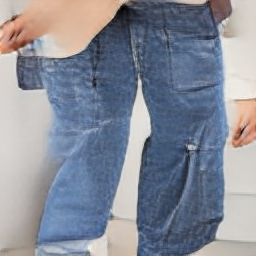

# KoDALLE

[](https://colab.research.google.com/drive/1sKNRH0fM73uLi-6BDgfGs3YiiVdvs6lU?usp=sharing) [](https://wandb.ai/kodalle/KoDALLE)

**Utilizing pretrained language model’s token embedding layer and position embedding layer as DALLE’s text encoder.**

### Background

- Training DALLE model from scratch demands large size paired dataset of images and captions. For example, OpenAI DALLE is trained with more than 250 million text-image pairs for the training.
- If the dataset isn’t large enough or is limited to specific domains, number of vocabularies in the trained DALLE model are insufficient. For instance, 1 million text captions of K-Fashion dataset only consists of more or less than 300 tokens.
- Therefore, inferencing from such DALLE models could be problematic if the given sentence query is unconnected to the originally trained captions’ text dataset.

### KoDALLE's Result on Small Size Fashion Dataset

**The team constructed Text to Fashion Design DALLE model in Korean language with less than 100k text-image sampled pairs.**

|                     |                                                                                                                                                                                                                                                                                                                       |
| :-----------------: | :-------------------------------------------------------------------------------------------------------------------------------------------------------------------------------------------------------------------------------------------------------------------------------------------------------------------: |
|     **Caption**     | 스타일에서 스타일은 리조트이다. 스타일에서 서브스타일은 모던이다. 원피스에서 기장은 미디이다. 원피스에서 색상은 와인이다. 원피스에서 카테고리는 드레스이다. 원피스에서 소매기장은 반팔이다. 원피스에서 소재에는 저지이다. 원피스에서 프린트에는 무지이다. 원피스에서 넥라인은 라운드넥이다. 원피스에서 핏은 루즈이다. |
| **Generated Image** |                                                                                                                                                                                                     |

|                     |                                                                                                                                                                                                                                                                                                                                                                                                                                                                                          |
| :-----------------: | :--------------------------------------------------------------------------------------------------------------------------------------------------------------------------------------------------------------------------------------------------------------------------------------------------------------------------------------------------------------------------------------------------------------------------------------------------------------------------------------: |
|     **Caption**     | 스타일에서 스타일은 컨트리이다. 스타일에서 서브스타일은 리조트이다. 하의에서 기장은 미디이다. 하의에서 색상은 베이지이다. 하의에서 카테고리는 스커트이다. 하의에서 디테일에는 플리츠이다. 하의에서 소재에는 실크이다. 하의에서 프린트에는 무지이다. 하의에서 핏은 루즈이다. 상의에서 기장은 롱이다. 상의에서 색상은 핑크이다. 상의에서 카테고리는 티셔츠이다. 상의에서 소매기장은 7부소매이다. 상의에서 소재에는 니트이다. 상의에서 프린트에는 무지이다. 상의에서 넥라인은 라운드넥이다. |
| **Generated Image** |                                                                                                                                                                                                                                                                                                                                                                        |

|                     |                                                                                                                                                                                                                                                                                                                                                                                                                                                                      |
| :-----------------: | :------------------------------------------------------------------------------------------------------------------------------------------------------------------------------------------------------------------------------------------------------------------------------------------------------------------------------------------------------------------------------------------------------------------------------------------------------------------: |
|     **Caption**     | 스타일에서 스타일은 로맨틱이다. 아우터에서 색상은 라벤더이다. 아우터에서 카테고리는 가디건이다. 아우터에서 디테일에는 단추이다. 아우터에서 소매기장은 반팔이다. 아우터에서 소재에는 니트이다. 아우터에서 프린트에는 무지이다. 아우터에서 넥라인은 브이넥이다. 아우터에서 핏은 노멀이다. 하의에서 기장은 미니이다. 하의에서 색상은 화이트이다. 하의에서 카테고리는 스커트이다. 하의에서 디테일에는 셔링이다. 하의에서 소재에는 우븐이다. 하의에서 프린트에는 무지이다 |
| **Generated Image** |                                                                                                                                                                                                                                                                                                                                                    |

|                     |                                                                                                                                                                                                                                                                             |
| :-----------------: | :-------------------------------------------------------------------------------------------------------------------------------------------------------------------------------------------------------------------------------------------------------------------------: |
|     **Caption**     | 스타일에서 스타일은 키치이다. 스타일에서 서브스타일은 스트리트이다. 하의에서 기장은 발목이다. 하의에서 색상은 블루이다. 하의에서 서브색상은 화이트이다. 하의에서 카테고리는 청바지이다. 하의에서 디테일에는 자수이다. 하의에서 소재에는 데님이다. 하의에서 핏은 스키니이다. |
| **Generated Image** |                                                                                                                                                                                             |

### Methodology

Experimentations were conducted with the following Korean Transformers Models’ embedding layers. The team selected klue/roberta-large as baseline in the repository considering the size of the model.

- **[klue/roberta-large](https://huggingface.co/klue/roberta-large): Vocab Size of 32000, Embedding Dimension of 1024.**
- [KoGPT Trinity of SKT](https://huggingface.co/skt/ko-gpt-trinity-1.2B-v0.5): Vocab Size of 51200, Embedding Dimension of 1920.
- [KoGPT of Kakao Brain](https://huggingface.co/kakaobrain/kogpt): Vocab Size of 64512, Embedding Dimension of 4096.

KoDALLE with klue/roberta-large's wpe and wte which is trainable on 16GB GPU Google Colab environment. Hyperparams related to the DALLE's model size are following.

```
'BATCH_SIZE': 32
'DEPTH': 2
'TEXT_SEQ_LEN': 128
'VOCAB_SIZE': 32000
'MODEL_DIM': 1024
'ATTN_TYPES': 'full'
'DIM_HEAD': 64
'HEADS': 8
```

- DALLE model is composed on [lucidrain's DALLE-pytorch](https://github.com/lucidrains/DALLE-pytorch)
- Image encoder is constructed based on [VQGAN(Taming Transformers)](https://github.com/CompVis/taming-transformers#training-on-custom-data)

### Significance

- Suggests effortless method of creating DALLE model for their own languages if pretrained language model is available.
- Introduces solution for domain specific DALLE models to be robust on input sentence queries.

---

### WIP

- [ ] Add image-caption reranker(EfficientNet + Klue/roberta-large)
- [ ] Model trained with 500k text-image pairs.
- [ ] Modulize in python code.
- [x] Update Inference code.
- [ ] Update FID and IS metrics on test and validation dataset.
